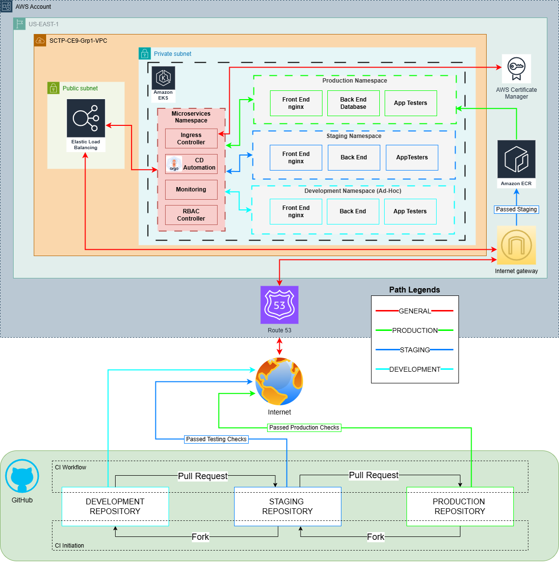

# SCTP-CE9-Grp1-Capstone

With efforts from the team:

* Aaron Lim
* Clifford Cheung
* Luke Jau
* Azni Osman
* Huang Cong Xuan (Daniel)

We present to you our take on a fast-growing startup that’s expanding its products across multiple regions. Our task is to improve the existing DevOps pipeline by turning it into a DevSecOps pipeline — adding security checks at every stage of the CI/CD process. In this Capstone project, we set up a basic CI/CD pipeline and focus on the security measures added to it.

## CONTENT

* [ARCHITECTURE](https://github.com/Lukej-git/ce-grp-1-docs/tree/main?tab=readme-ov-file#architecture-)
  1. :eyes: [AT-A-GLANCE](https://github.com/Lukej-git/ce-grp-1-docs/tree/main?tab=readme-ov-file#1-eyes-at-a-glance)
  2. :mag\_right: [DIAGRAM](https://github.com/Lukej-git/ce-grp-1-docs/tree/main?tab=readme-ov-file#2-mag_right-diagram)
  3. 🔧 [IaC STACK](https://github.com/Lukej-git/ce-grp-1-docs/tree/main?tab=readme-ov-file#3--iac-stack)
  4. 🔁 [CI/CD](https://github.com/Lukej-git/ce-grp-1-docs/tree/main?tab=readme-ov-file#4--cicd)
     1. [REPOSITORIES STRUCTURE](https://github.com/Lukej-git/ce-grp-1-docs/tree/main?tab=readme-ov-file#4a-repositories)
  5. 🔐 [SECURITY](https://github.com/Lukej-git/ce-grp-1-docs/tree/main?tab=readme-ov-file#5--security)
     1. [RBAC STRATEGIES](https://github.com/Lukej-git/ce-grp-1-docs/tree/main?tab=readme-ov-file#5a-rbac-strategies)
  6. 📈 [MONITORING](https://github.com/Lukej-git/ce-grp-1-docs/tree/main?tab=readme-ov-file#6--monitoring)
* [APPLICATION DEPLOYMENT](https://github.com/Lukej-git/ce-grp-1-docs/tree/main?tab=readme-ov-file#application-deployment)
* [FUTURE](https://github.com/Lukej-git/ce-grp-1-docs/tree/main?tab=readme-ov-file#future)

## ARCHITECTURE 

### 1. :eyes: AT-A-GLANCE

A GitOps-driven EKS deployment using Argo CD, Terraform, and AWS-native services with secure HTTPS, monitoring, and CI/CD.

### 2. :mag\_right: DIAGRAM

<figure><figcaption></figcaption></figure>

### 3. 🔧 IaC STACK

Using Terraform, we resources the following:

* VPC with public/private subnets;
* EKS with EC2 and managed nodegroups;
* Route 53 hosted zone + ACM (HTTPS) certs;
* IRSA roles for ALB, ExternalDNS, Prometheus.

### 4. 🔁 **CI/CD**

* GitHub Actions for:
  * Terraform Plan & Apply
  * Docker builds and image pushes
  * Syncing Argo CD manifests per environment (namespaces)
* ArgoCD for CD automation with fast rollback capability ([local link](https://localhost:8080/applications))

#### 4a. REPOSITORIES

<table><thead><tr><th width="174.99993896484375" align="center">Repository</th><th align="center">Role/Policy Tagging</th><th align="center">Link</th></tr></thead><tbody><tr><td align="center">PRODUCTION</td><td align="center">env: prod</td><td align="center"></td></tr><tr><td align="center">STAGING</td><td align="center">env: staging</td><td align="center">forked from PROD</td></tr><tr><td align="center">DEVELOPMENT</td><td align="center">env: dev</td><td align="center">forked from STAGING</td></tr><tr><td align="center">ADMIN</td><td align="center">NA</td><td align="center"> </td></tr></tbody></table>

### 5. 🔐 **SECURITY**

* IAM least privilege (Through ArgoCD RBAC)
* Repositories segregated and review-gated
* Vulnerability checking at IaC deployment
* HTTPS enforced via ALB
* Argo CD RBAC and external secret support

#### **5a. RBAC STRATEGIES**

<table><thead><tr><th width="175" align="center">Role</th><th align="center">Access Level</th><th align="center">Role/Policy Tagging</th></tr></thead><tbody><tr><td align="center">PRODUCTION</td><td align="center">Full (Includes below and Delete etc)</td><td align="center">env: prod</td></tr><tr><td align="center">STAGING</td><td align="center">Limited (Create/Deploy/Test Only)</td><td align="center">env: staging</td></tr><tr><td align="center">DEVELOPMENT</td><td align="center">Restricted (Update/Deploy/Test Only)</td><td align="center">env: dev</td></tr><tr><td align="center">ADMIN</td><td align="center">ADMIN</td><td align="center">NA</td></tr></tbody></table>

### 6. 📈 **MONITORING**

* Prometheus + Grafana with PVC
* TLS-enabled dashboards

## APPLICATION DEPLOYMENT

* NGINX: [https://ce-grp-1.sctp-sandbox.com](https://ce-grp-1.sctp-sandbox.com/) and [https://ce-grp-1.sctp-sandbox.com/app2/](https://ce-grp-1.sctp-sandbox.com/app2)
* Monitoring: Prometheus + Grafana at [https://prometheus.ce-grp-1.sctp-sandbox.com/](https://prometheus.ce-grp-1.sctp-sandbox.com/) and [https://grafana.ce-grp-1.sctp-sandbox.com/](https://grafana.ce-grp-1.sctp-sandbox.com/)
* Argo CD App-of-Apps structure with multi-environments

## FUTURE

* TLS certifications for monitoring apps need to be included, not implemented yet.
* Currently using one cluster and isolate environments by namespace is not ideal, recommend to isolate environments by cluster.
* Not used in this project, Checkov scans cloud infrastructure configurations to find misconfigurations before they're deployed. Not needed yet at this scale.

## REFERENCE

* [Detailed Slide Deck](https://docs.google.com/presentation/d/1tDqysmuKZ3f1lS4KDNFe13fID11KId1O/edit?usp=sharing\&ouid=108921775124130638700\&rtpof=true\&sd=true)

